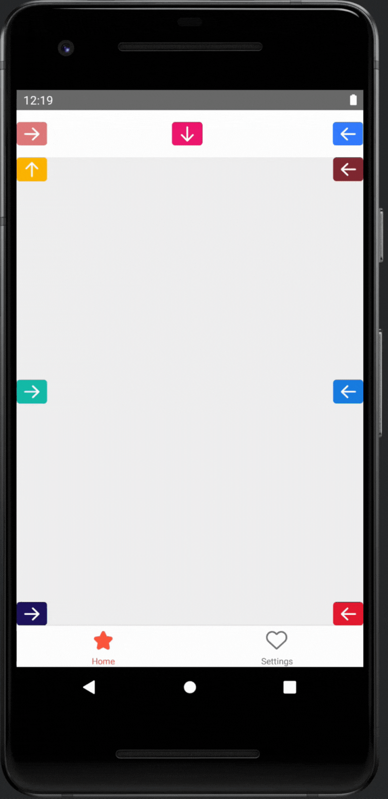
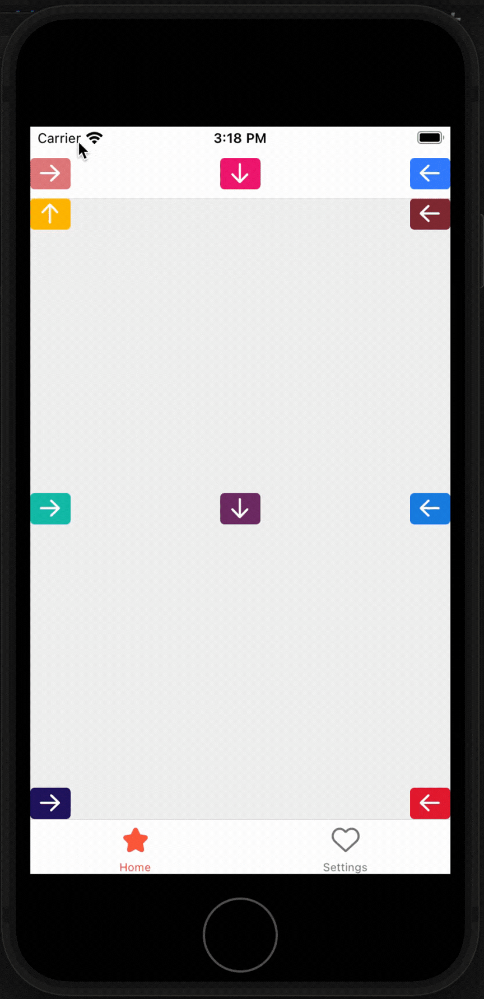
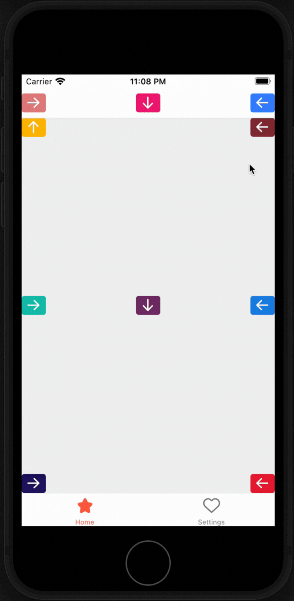
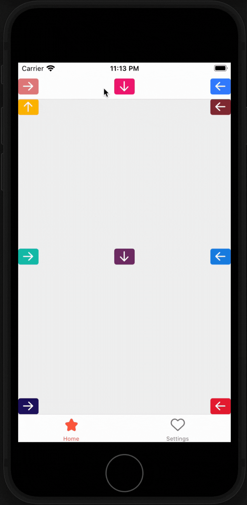
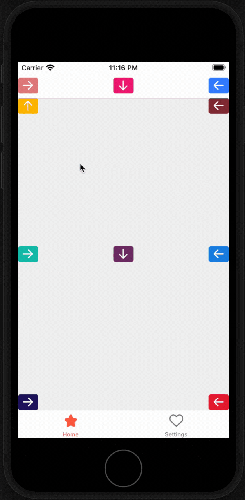
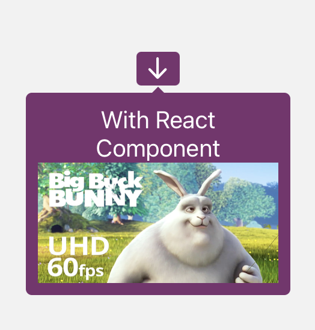

# React Native Tooltipster
<div align="center">
<h2>💬 Truely native tooltip for your React Native app 💬</h2>



</div>

## Installation

```sh
npm install react-native-tooltipster

# or with yarn

yarn add react-native-tooltipster
```

Next install CocoaPods deps:

```
npx pod-install ios
```

## Usage
You can show tooltip for any component you want

```tsx
import Tooltipster from 'react-native-tooltipster';

<Tooltipster
  text="Lorem Ipsum ipdoor"
  bgColor="#ffbd00"
>
  <Text>Hello world</Text>
</Tooltipster>

// Or

<Tooltipster
  text="Lorem Ipsum is simply dummy text of the printing and typesetting industry"
  bgColor="#ffbd00"
>
  <View>
    <Text>Hello world</Text>
    <Text>It's a good day</Text>
  </View>
</Tooltipster>
```

# Props
First thing to note is, since this tooltip component renders native view, so sometimes you may need some extra codes to handle platform-specific styles (usually happens if tooltip position is `left or right`).

Example:
```tsx
<Tooltipster
  text="Normal size arrow"
  bgColor="#8c2f39"
  position="left"
  arrowPositionRules="ALIGN_BUBBLE"
  padding={{
    right: Platform.select({
      ios: 15,
      android: undefined
    })
  }}
>
```
Check out [example folder](./example/src/App.tsx) for complete usage

## `animation`
- Description: tooltip show animation
- Value: type `SCALE` | `FADE`. Default `SCALE`

<div align="center">

</div>

## `arrowSize`
- Description: size of the arrow of tooltip
- Value: type `number`. Default `10`

<div align="center">

</div>

## `position`
- Description: position of the arrow align to the anchor
- Value: type `top` | `right` | `bottom` | `left`. Default `bottom` on Android, `any` (auto) on iOS

## `arrowPositionRules` (Android only)
- Description: align arrow by Anchor or bubble (the tooltip itself). This is useful in some cases where `position=left|right`
- Value: type `ALIGN_BUBBLE` | `ALIGN_ANCHOR`. Default `ALIGN_ANCHOR`

## `text`
- Description: text of tooltip
- Value: type `string`. Default `""` (empty string)

## `textAlign`
- Description: text alignment
- Value: type `left` | `right` | `center`. Default `center`

<div align="center">

</div>

## `textLineHeight`
- Description: line height of the text
- Value: type `number`. Default `undefined`

<div align="center">

</div>

## `textColor`
- Description: text color
- Value: type `string`. Default `white`

## `fontSize`
- Description: text font size
- Value: type `number`. Default `12` on Android, `15` on iOS

## `fontWeight`
- Description: text font weight
- Value: type `BOLD` | `BOLD_ITALIC` | `ITALIC` | `NORMAL`. Default `NORMAL`

## `cornerRadius`
- Description: tooltip border radius 
- Value: type `number`. Default `5`

## `bgColor`
- Description: tooltip background
- Value: type `string`. Default `#1c7bf6`

## `maxWidth`
- Description: tooltip max width
- Value: type `number`. Default `<SCREEN_WIDTH>`

<div align="center">

</div>

## `padding`
- Description: padding of the tooltip
- Value: type `{top?: number, right?: number, bottom?: number , left?: number}`. Default `{top: 10, right: 10, bottom: 10 , left: 10}`

## `margin`
- Description: margin of the tooltip
- Value: type `{top?: number, right?: number, bottom?: number , left?: number}`. Default `{top: 1, right: 1, bottom: 1 , left: 1}`

## `dismissOnClick`
- Description: dismiss the tooltip if click on itself
- Value: type `boolean`. Default `false`

## `renderTemplate` (iOS only)
- Description: React component for the tooltip
- Value: type `Function`. Default `undefined`

Example:
```tsx
<Tooltipster
  bgColor="#7A316F"
  animation="FADE"
  renderTemplate={() => (
    <>
      <Text
        style={{ color: 'white', fontSize: 20, textAlign: 'center' }}
      >
        With React Component
      </Text>
      <Image
        source={require('./assets/bunny.jpg')}
        style={{
          width: 200,
          height: 100,
          resizeMode: 'stretch',
        }}
      />
    </>
  )}
>
  <TouchableOpacity
    style={[styles.button, { backgroundColor: '#7A316F' }]}
  >
    <Icon name={'arrowdown'} size={24} color={'white'} />
  </TouchableOpacity>
</Tooltipster>
```
<div align="center">

</div>

# Events
- `onClick`: on click bubble (the tooltip)
- `onDismissed`: on tooltip dismissed

# Examples

Check out [example folder](./example/src/App.tsx) for complete usage

# Thanks
- [Android Balloon](https://github.com/skydoves/Balloon)
- [Swift EasyTipView](https://github.com/teodorpatras/EasyTipView)
- [React native menu](https://github.com/react-native-menu/menu): for teaching me how to write better Kotlin code